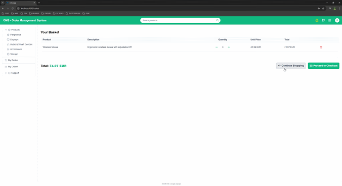
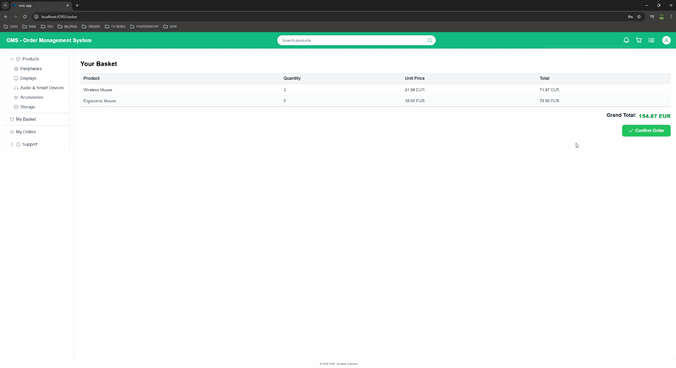

# 🧩 Order Management System (OMS)

| CI Status                                                                                                                                                                                               | License                                                                                                                                                                                                          |
|---------------------------------------------------------------------------------------------------------------------------------------------------------------------------------------------------------|------------------------------------------------------------------------------------------------------------------------------------------------------------------------------------------------------------------|
| [](https://github.com/hirannor/oms-hexagonal-architecture-ddd/actions/workflows/ci.yml) | [](https://opensource.org/licenses/MIT) [](https://commonsclause.com/) |

---

## 🧭 Overview

The **Order Management System (OMS)** is a **full-stack demo project** that showcases  
modern enterprise application design using **Hexagonal Architecture**, **Domain-Driven Design (DDD)**,  
and **event-driven communication** between bounded contexts.

### Tech Highlights

- **Backend:** Spring Boot 3 · Java 21 · Hexagonal Architecture · DDD · RabbitMQ · PostgreSQL
- **Frontend:** Angular 20 (Nx Monorepo + NgRx) · PrimeNG · TypeScript
- **API Contract:** Centralized [OpenAPI 3.0.3](openapi/) definitions shared between backend & frontend

> 📘 For in-depth domain and architecture documentation:
>
> - **Backend:** [oms-backend/README.md](oms-backend/README.md) — Spring Boot + DDD + Hexagonal Architecture
> - **Frontend:** [oms-frontend/README.md](oms-frontend/README.md) — Angular 20 + Nx + NgRx Modular Monorepo

## ⚙️ Architecture Overview

### Backend — Hexagonal (Ports & Adapters)

| Layer           | Responsibility                                                       |
|:----------------|:---------------------------------------------------------------------|
| **Domain**      | Core business logic, aggregates, and domain events.                  |
| **Application** | Use-case orchestration and coordination between domain and adapters. |
| **Adapters**    | Persistence, messaging, web, and external system integrations.       |

The architecture enforces clear separation through **ArchUnit** tests and follows a strict dependency flow:

### Frontend — Nx Modular Architecture

The Angular workspace mirrors backend boundaries:


- `libs/<domain>/<*-feature>` → Feature-specific UI modules (e.g., order, customer, product)  
  Contain routed feature shells, presentation components, and feature-specific UIs.

- `libs/<domain>/*-data-access` → State management and domain data layer  
  Includes NgRx store, actions, reducers, selectors, effects, facades, and domain ports/adapters.

- `libs/openapi/*-data-access` → Generated OpenAPI clients for backend APIs  
  Auto-generated TypeScript clients with raw API services and models.

- `libs/shared-*` → Reusable shared libraries  
  Provide cross-cutting UI components, interceptors, guards, and utilities.

- `libs/models` → Core domain model types and interfaces  
  Define the data structures shared across all domains and layers.

---

## 🧩 Domain Model

| Aggregate     | Responsibility                                                                                                           |
|---------------|--------------------------------------------------------------------------------------------------------------------------|
| **Customer**  | Represents a system user; handles registration, authentication, and profile management.                                  |
| **Order**     | Full order lifecycle (creation → payment → shipment → delivery → refund); emits events like `OrderCreated`, `OrderPaid`. |
| **Basket**    | Shopping cart per customer; add/remove products and initiate checkout.                                                   |
| **Product**   | Catalog item with immutable attributes (id, name, price, currency).                                                      |
| **Inventory** | Tracks stock; supports `reserve`, `release`, `deduct`; prevents overselling.                                             |
| **Payment**   | Lifecycle via Stripe (`INITIALIZED → SUCCEEDED/FAILED/CANCELED`); emits events like `PaymentSucceeded`.                  |

All aggregates emit **domain events**, which are persisted and published asynchronously for eventual consistency.

---

## 📡 Messaging & Event Flow

The backend leverages an **Outbox Pattern + RabbitMQ** setup for guaranteed, reliable delivery:

1. Domain events are persisted in the **Outbox** table (same transaction).
2. A scheduled job publishes messages from Outbox → RabbitMQ exchange.
3. Rabbit listeners consume messages and re-emit them as in-app events.

This ensures **exactly-once semantics** and stable inter-module communication.

---

## 🌐 Frontend (Angular + Nx + NgRx)

### Key Concepts

- Modular feature libraries for each domain (`auth`, `basket`, `order`, `product`, etc.)
- Typed REST clients generated from `/openapi` using:
  ```bash
  npm run generate:apis



